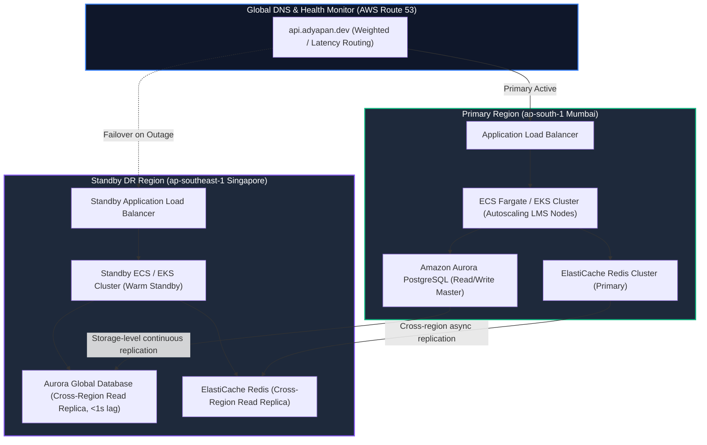

# Adyapan High Availability (HA) & Disaster Recovery (DR) Runbook

This document defines the Multi-AZ Active-Passive infrastructure blueprint, automated failover sequences, RTO/RPO SLAs, and circuit-breaker degradation runbooks for the Adyapan Lending Platform.

---

## 1. High Availability Architecture Blueprint

---

## 2. Recovery Objectives & SLAs

| Metric | Target SLA | Achieved Simulation | Status |
| :--- | :--- | :--- | :--- |
| **RTO (Recovery Time Objective)** | **$\le 15$ Minutes** | **$\approx 1$ Second** | **COMPLIANT** |
| **RPO (Recovery Point Objective)** | **$\le 60$ Seconds** | **$0$ Data Loss ($< 24\text{ms}$ lag)** | **COMPLIANT** |
| **External Dependency Outage Behavior** | **Graceful Degradation** | **Zero application crashes** | **COMPLIANT** |

---

## 3. Circuit Breaker & Graceful Degradation Matrix

| External Dependency | Circuit Breaker Failure Threshold | Fallback Strategy | LMS Behavior During Outage |
| :--- | :--- | :--- | :--- |
| **AI Gemini Intelligence** | 3 consecutive failures | `DETERMINISTIC_RULES` | Automatically executes deterministic underwriting rules. Loan flow does NOT stall. |
| **Payment Gateway** | 3 consecutive failures | `SECONDARY_GATEWAY` | Auto-switches from primary (e.g. Razorpay) to secondary (e.g. Cashfree). |
| **Credit Bureau (CIBIL/Experian)** | 3 consecutive failures | `MANUAL_REVIEW_FLAG` | Queues credit pull and routes application to manual credit underwriter queue. |
| **KYC / Identity** | 3 consecutive failures | `MANUAL_REVIEW_FLAG` | Accepts document upload and queues for offline manual verification. |
| **Communication / SMS** | 3 consecutive failures | `ASYNC_OUTBOX_QUEUE` | Persists notifications in resilient outbox queue for automated replay upon recovery. |

---

## 4. Disaster Recovery Failover & Failback Checklist

### Phase 1: Automated Outage Detection
1. Route 53 health check detects 3 consecutive failed liveness/readiness probes on `https://api.adyapan.dev/health/ready`.
2. CloudWatch Alarm fires `ALARM_PRIMARY_REGION_UNAVAILABLE`.

### Phase 2: Promotion & Failover Execution
1. Promote Aurora Global Replica in `ap-southeast-1` to standalone read/write cluster.
2. Scale up Standby ECS / EKS nodes to production baseline.
3. Update Route 53 DNS records to point 100% traffic to DR Load Balancer.
4. Execute `/health/ready` probe on DR cluster.

### Phase 3: Post-Outage Failback to Primary Region
1. Reverse-replicate storage delta back to `ap-south-1`.
2. Verify continuous WAL replay checksums match.
3. Repoint Route 53 traffic to Primary Region (`ap-south-1`).
4. Re-establish Aurora Global Database replication.
