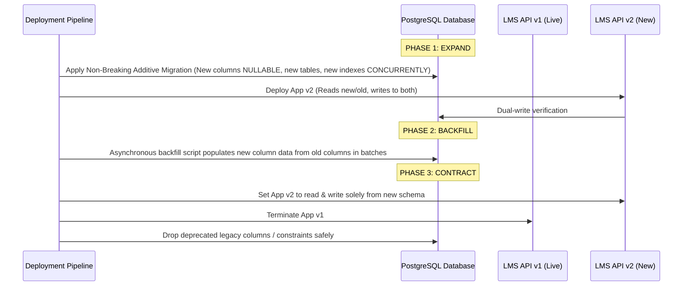

# Adyapan Zero-Downtime Migration & Database Hardening Guide

This document defines the high-availability database management, connection pooling, and zero-downtime migration protocols for the Adyapan Lending Platform.

---

## 1. Zero-Downtime Migration Pattern: Expand and Contract

To prevent locking tables or breaking in-flight transactions during live financial operations:



---

## 2. PgBouncer Connection Pooling Strategy

- **Pool Mode**: `Transaction` pooling for general API read/write operations.
- **Max Client Connections**: 500
- **Default Pool Size**: 25 per tenant schema.
- **Reserve Pool Size**: 5 (allocated for burst underwriting transactions).
- **Idle Timeout**: 60s.

---

## 3. Index Maintenance & Automated Vacuuming

Run weekly maintenance via PostgreSQL cron:

```sql
-- Analyze and update query planner statistics
VACUUM (ANALYZE, VERBOSE) "LoanApplication";
VACUUM (ANALYZE, VERBOSE) "Repayment";
VACUUM (ANALYZE, VERBOSE) "AuditLog";

-- Concurrent index creation to eliminate table write locks
CREATE INDEX CONCURRENTLY IF NOT EXISTS idx_loan_app_tenant_status 
ON "LoanApplication" ("tenantId", "status", "createdAt" DESC);
```

---

## 4. Point-In-Time Recovery (PITR) & Automated Backups

- **WAL Archiving**: Continuous WAL segment archiving to encrypted S3 bucket (`s3://adyapan-db-wal-archives/`).
- **Base Backup Schedule**: Full automated pg_dump / pg_basebackup daily at 01:00 UTC.
- **Retention**: 35-day continuous PITR recovery capability.
