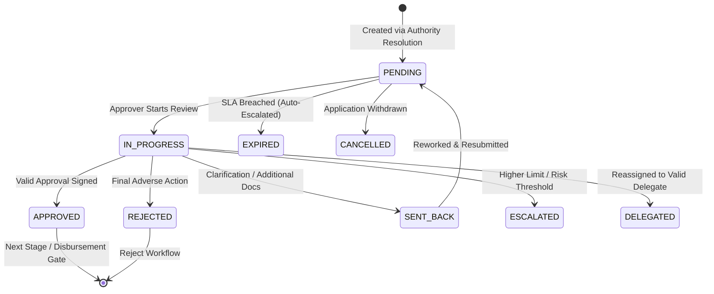

# Adyapan Lending OS — Approval Workflow Architecture

## Overview
The Approval Workflow Engine orchestrates stage-gated institutional sign-offs after automated credit policy evaluation (BRE / Decision Engine). It eliminates hardcoded approval thresholds and replaces them with an asynchronous, deterministic, and auditable approval lifecycle.

---

## 1. Approval Lifecycle States

Approval tasks transition through the following strictly managed states:



- **`PENDING`**: Task created and assigned to the resolved authority level / role / branch queue.
- **`IN_PROGRESS`**: Underwriter / Manager has opened the task for review.
- **`APPROVED`**: Task approved. If multi-level approval is configured, the next approval level task is generated; otherwise the application moves to `READY_FOR_DISBURSEMENT`.
- **`REJECTED`**: Application is rejected with immutable adverse reasons and audit entries.
- **`SENT_BACK`**: Sent back to target stage (e.g. `CREDIT_ASSESSMENT`, `DOCUMENT_VERIFICATION`) requiring specific clarifications.
- **`ESCALATED`**: Manually or automatically escalated to a higher level in the hierarchy matrix.
- **`DELEGATED`**: Temporarily transferred to a nominated delegate with active delegation window.

---

## 2. Multi-Level Sequential Approval Gates

For high-value or high-risk facilities, approvals are stage-gated sequentially:

```
[ BRE Evaluation: APPROVE ]
           │
           ▼
[ Level 1: Branch Manager ] ──► (₹0 – ₹5L facility) ──► Complete (Disbursement Unlocked)
           │ (If ₹8L requested, Level 1 sign-off is prerequisite)
           ▼ APPROVED
[ Level 2: Senior Underwriter ] ──► (Up to ₹10L facility) ──► Complete (Disbursement Unlocked)
           │ (If ₹25L requested, Level 2 sign-off is prerequisite)
           ▼ APPROVED
[ Level 3: Credit Head / Committee ] ──► Final Sign-off ──► READY_FOR_DISBURSEMENT
```

Disbursement is strictly blocked at the backend level until **all** required approval levels are signed off.

---

## 3. BRE Integration & Condition Handling

- **`APPROVE`**: Unconditional task creation assigned to minimum matching authority level.
- **`APPROVE_WITH_CONDITIONS`**: BRE stipulations (e.g., Salary slip verification, CIBIL bureau refresh) are preserved and attached to the approval task. The approver must review and confirm condition adherence before signing off.
- **`REFER`**: Applications requiring manual exception assessment are routed to configured Credit Analyst / Underwriter queues.
- **`REJECT`**: Normal approvers cannot overturn system rejections without explicit `decision.override` permissions and authorized exception governance.

---

## 4. SLA & Auto-Escalation Engine

Every approval task computes target resolution time based on product and tenant SLA definitions:
- Tracks `assignedAt`, `dueAt`, `completedAt`, and `timeRemaining`.
- Emits real-time SLA metrics to the Approver Queue.
- Flags `SLA_BREACHED` and triggers automatic audit logs and notification alerts for queue supervisors.
