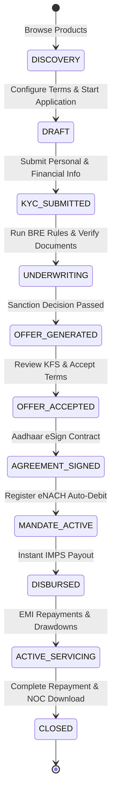

# End-to-End Borrower Journey

## Lifecycle Overview

The borrower journey transitions across 7 core stages, backed by real-time status synchronization across frontend components and backend services.

## Stage Descriptions

### Stage 1: Product Discovery & Application Intake
- **Component**: `<ProductDiscovery />`, `<ApplicationWizard />`
- **Actions**: Borrowers select product type (e.g., Personal, Micro-SME, Credit Line), adjust requested amount & tenure sliders, and initialize draft applications.
- **Persistence**: Application drafts support partial saves to local storage and backend persistence via `PATCH /api/v1/applications/:id`.

### Stage 2: e-KYC & Document Vault
- **Component**: `<KycVerificationView />`, `<DocumentUploadCenter />`
- **Actions**: Real-time validation of PAN, Aadhaar DigiLocker verification, selfie face-match, and document upload (Salary slips, Bank statements, Address proofs).

### Stage 3: Underwriting & Decisioning
- **Component**: `<StageGatedJourney />`
- **Actions**: Backend passes the application to the BRE (Business Rules Engine) for credit score evaluation, FOIR compliance, and risk grading (Risk A through E).

### Stage 4: Offer Engine & Statutory KFS Review
- **Component**: `<BorrowerOfferModal />`
- **Actions**: Generates precise pricing terms: Monthly EMI, Processing Fee + 18% GST, Stamp Duty, and statutory Annual Percentage Rate (APR). Explicit KFS acknowledgment is legally enforced.

### Stage 5: Digital Contract & Aadhaar eSign
- **Component**: `<AgreementAndEsignView />`
- **Actions**: Renders legally compliant digital loan agreement and binds it via Aadhaar eSign / OTP digital signature certificate.

### Stage 6: eNACH Mandate Registration
- **Component**: `<MandateSetupView />`
- **Actions**: Sets up NPCI eNACH automated standing debit instructions for hassle-free installment collection.

### Stage 7: Automated Payout & Active Loan Servicing
- **Component**: `<DisbursementStatusCard />`, `<ActiveLoanManager />`, `<CreditLineManager />`
- **Actions**: Instant IMPS payout execution, live repayment ledger tracking, self-service UPI/NetBanking payments with double-entry accounting, and instant revolving line drawdowns.
