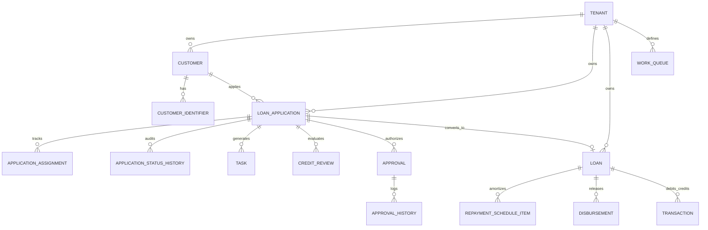

# Adyapan Lending OS — Core Lending Data Model & Operational Workflow Architecture (Phase 17)

## 1. Executive Summary & Design Principles

Phase 17 establishes the core operational substrate of Adyapan Lending OS. Building upon the Department, Role, Workspace, and Portal architecture from Phase 16, this phase normalizes the lifecycle of lending entities, separating operational progression (**Stage**) from disposition state (**Status**), providing multi-department work routing (**WorkQueues**), auditable ownership assignment (**ApplicationAssignment**), cross-functional SLA tracking (**Task Engine**), polymorphic activity logging (**ActivityLog**), KYC/identifier masking (**CustomerIdentifier**), formal underwriting assessment (**CreditReview**), tiered sanctioning authority (**Approval Engine**), and controlled atomic conversion to active loan accounts (**LoanConversionService**).

---

## 2. Stage vs. Status Separation

In institutional lending, conflating the business progression stage with a binary or granular status leads to deadlocks. Phase 17 enforces a two-dimensional state space:

### 2.1 Stage Lifecycle
The 12 canonical macro stages of an application:
1. `LEAD`: Sourced prospect or inbound inquiry.
2. `APPLICATION_STARTED`: Borrower initiated digital/assisted onboarding.
3. `APPLICATION_SUBMITTED`: Form data and KYC documents submitted.
4. `DOCUMENT_VERIFICATION`: Document completeness, OCR, and verification.
5. `CREDIT_ASSESSMENT`: Bureau pull, financial analysis, FOIR/DTI computation.
6. `UNDERWRITING`: Risk evaluation, covenant formulation, and sanction proposal.
7. `APPROVAL`: Single/Multi-tier sanction authority decisioning.
8. `SANCTION`: Sanction letter issuance and borrower acceptance.
9. `DISBURSEMENT`: Mandate setup, penny drop, and payment gateway queueing.
10. `DISBURSED`: Funds released by treasury / banking partner.
11. `ACTIVE`: Live loan account with active repayment schedule.
12. `CLOSED`: Loan fully settled, foreclosed, or written off.

Terminal / Exit Stages:
- `REJECTED`: Application declined at any review stage.
- `WITHDRAWN`: Application cancelled by applicant.

### 2.2 Status Matrix
Within each stage, entities progress through granular disposition states:
- `DRAFT`, `SUBMITTED`, `IN_PROGRESS`, `PENDING`, `APPROVED`, `REJECTED`, `DISBURSED`, `COMPLETED`, `EXPIRED`, `CANCELLED`.

---

## 3. Core Entity Relational Model

---

## 4. Work Queues & Queue Routing

To prevent bottlenecking on individual staff members, applications route through departmental pools:

| Queue Code | Name | Department | Target Workloads |
| :--- | :--- | :--- | :--- |
| `OPERATIONS_QUEUE` | Operations Verification Queue | `OPERATIONS` | KYC verification, document validation, applicant contact |
| `CREDIT_REVIEW_QUEUE` | Credit Assessment Desk | `CREDIT` | Financial statement analysis, bank statement parsing, CAM |
| `UNDERWRITING_QUEUE` | Underwriting & Risk Queue | `CREDIT` | Sanction proposal, covenant drafting, risk rating |
| `SANCTION_APPROVAL_QUEUE` | Committee & Sanction Approval | `MANAGEMENT` | Delegated lending authority sign-off (L1/L2/L3/Board) |
| `DISBURSEMENT_QUEUE` | Treasury & Disbursement Queue | `FINANCE` | Mandate verification, fund allocation, IMPS/NEFT release |
| `COLLECTIONS_QUEUE` | Delinquency & Recovery Queue | `COLLECTIONS` | Early delinquency, DPD tracking, recovery call allocation |

---

## 5. Controlled Application-to-Loan Conversion

The `LoanConversionService` executes an atomic database transaction (`prisma.$transaction`) ensuring:
1. Application validation (`DISBURSEMENT` / `SANCTION` stage validation).
2. Duplicate conversion guard (rejection if `application.loan` exists).
3. Active Loan account generation with institutional numbering (`LN-...`).
4. EMI and amortization generation (`RepaymentScheduleItem` batch insertion).
5. Initial disbursement log and transaction entry creation.
6. Application stage transition to `DISBURSED` with audit trail and notification.

---

## 6. Security, Masking & Multi-Tenant Isolation

1. **PII Masking**: PAN (`ABCDE1234F` -> `XXXXXX34F`), Aadhaar (`123456789012` -> `XXXXXXXX9012`), Bank Accounts (`1234567890` -> `XXXXXX7890`).
2. **Multi-Tenant Scoping**: All Prisma queries, mutations, and assignments enforce `where: { tenantId }`.
3. **Immutable History**: `ApplicationStatusHistory`, `ApprovalHistory`, and `ActivityLog` entries are append-only.
