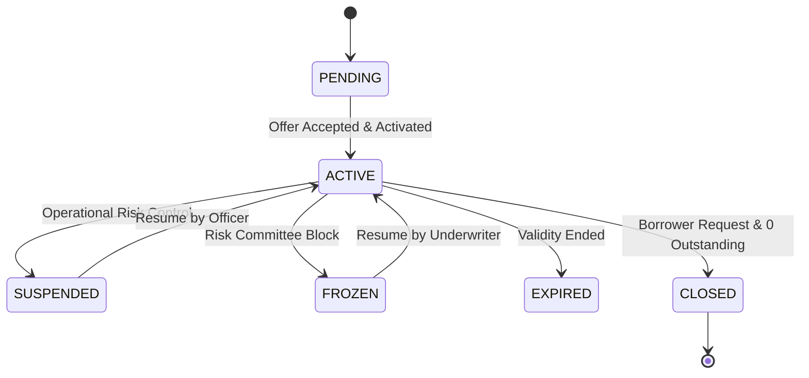

# Credit Facility & Balances Architecture

## Facility Taxonomy & Status States
A `CreditFacility` transitions through the following lifecycle states:

## Supported Facility Types
1. `REVOLVING_CREDIT`: Available balance restores automatically upon principal repayment.
2. `CREDIT_LINE`: Fixed-term or ongoing line of credit with multi-drawdown capability.
3. `BNPL`: Merchant-linked micro-credit line.
4. `ONE_TIME_LOAN`: Single drawdown facility where repayment does not replenish credit line.
5. `OVERDRAFT`: Current account linked buffer facility.
