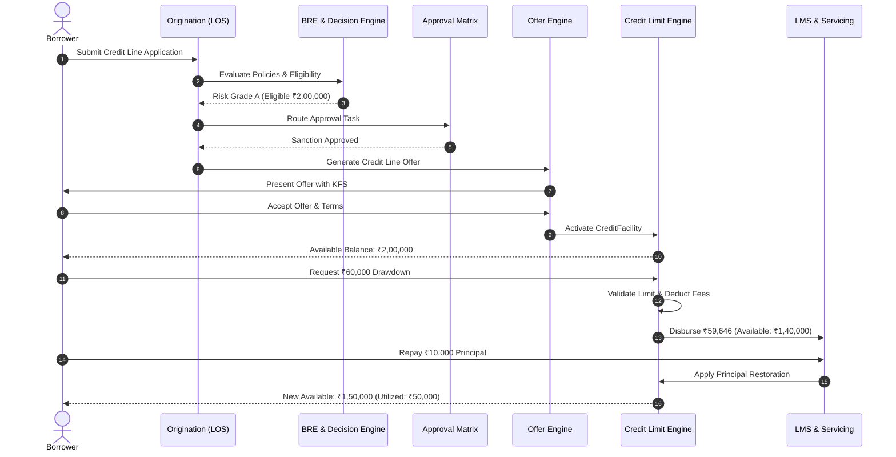

# Credit Limit Lifecycle & Governance

## End-to-End Origination to Limit Restoration

```mermaid
sequenceDiagram
    autonumber
    actor Customer as Borrower
    participant LOS as Origination (LOS)
    participant BRE as BRE & Decision Engine
    participant Matrix as Approval Matrix
    participant Offer as Offer Engine
    participant Facility as Credit Limit Engine
    participant LMS as LMS & Servicing

    Customer->>LOS: Submit Credit Line Application
    LOS->>BRE: Evaluate Policies & Eligibility
    BRE-->>LOS: Risk Grade A (Eligible ₹2,00,000)
    LOS->>Matrix: Route Approval Task
    Matrix-->>LOS: Sanction Approved
    LOS->>Offer: Generate Credit Line Offer
    Offer->>Customer: Present Offer with KFS
    Customer->>Offer: Accept Offer & Terms
    Offer->>Facility: Activate CreditFacility
    Facility-->>Customer: Available Balance: ₹2,00,000

    Customer->>Facility: Request ₹60,000 Drawdown
    Facility->>Facility: Validate Limit & Deduct Fees
    Facility->>LMS: Disburse ₹59,646 (Available: ₹1,40,000)

    Customer->>LMS: Repay ₹10,000 Principal
    LMS->>Facility: Apply Principal Restoration
    Facility-->>Customer: New Available: ₹1,50,000 (Utilized: ₹50,000)
```
