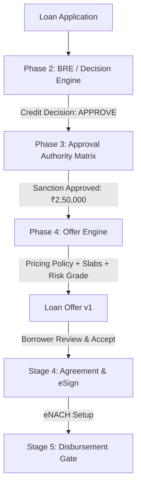

# Adyapan Lending OS — Offer Engine Architecture

## Overview
The **Offer Engine** converts an approved credit decision from the BRE and Approval Authority Matrix into a precise, legally compliant, RBI Key Fact Statement (KFS)-ready loan offer.

---

## 1. Domain Separation of Responsibilities

- **BRE**: *"Should this applicant receive credit?"*
- **Approval Authority**: *"Who is authorized to sanction it?"*
- **Offer Engine**: *"What exact terms, rates, fees, and schedule are offered?"*

---

## 2. Authoritative Amount Resolution

The sanctioned principal is bounded deterministically:
$$\text{Offered Amount} = \min(\text{Requested Amount}, \text{BRE Eligible Amount}, \text{Authority Approved Amount}, \text{Product Max Cap})$$

All computations use `Decimal.js` to guarantee zero floating-point variance.

---

## 3. Financial Calculation & KFS Alignment

1. **Monthly EMI**: Reducing Balance Annuity ($P \cdot r \cdot (1+r)^n / ((1+r)^n - 1)$) or Fixed Flat Interest.
2. **Upfront Deductions**: Processing fee, documentation charges, platform charges + statutory 18% GST.
3. **Net Disbursement**: $\text{Sanctioned Principal} - \text{Total Upfront Fees \& Taxes}$.
4. **Statutory APR**: Exact Internal Rate of Return (IRR) annualized over net disbursed cash flows.
