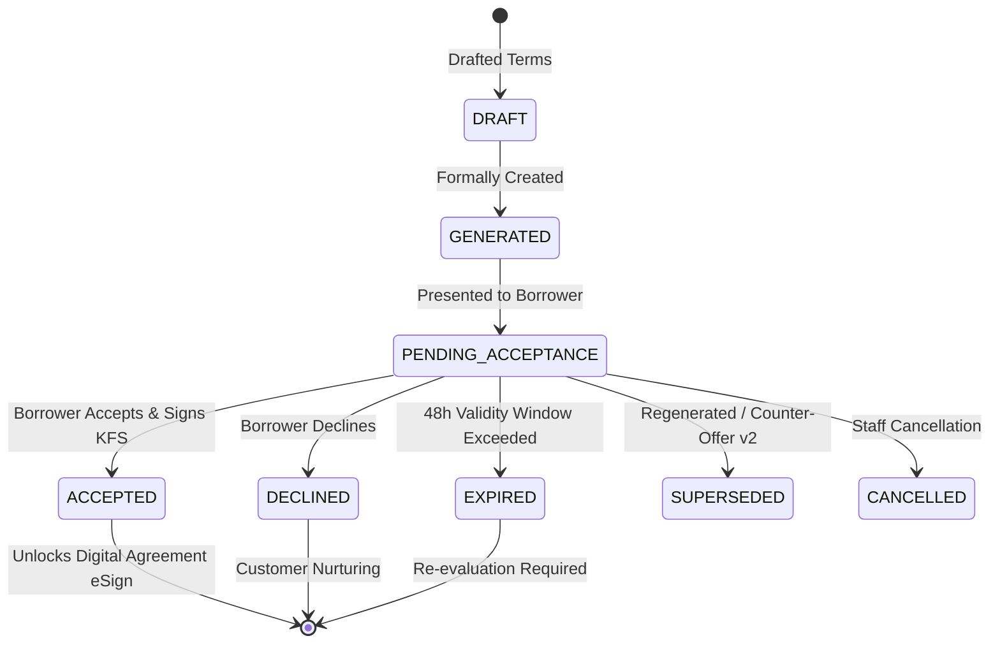

# Adyapan Lending OS — Offer Lifecycle State Machine

## Overview
Loan offers transition through an immutable, auditable state machine with strict time-validity and gating rules.

---

## 1. Lifecycle State Machine

---

## 2. State Descriptions

| State | Trigger | Next Allowed States | Description |
|---|---|---|---|
| **`PENDING_ACCEPTANCE`** | Generated after Approval | `ACCEPTED`, `DECLINED`, `EXPIRED`, `SUPERSEDED`, `CANCELLED` | Active offer presented to borrower for digital review. |
| **`ACCEPTED`** | Borrower clicks Accept | `None` (Finalized) | Borrower acknowledges KFS & terms. Advances application to `AGREEMENT_PENDING`. |
| **`DECLINED`** | Borrower clicks Decline | `None` (Finalized) | Borrower opts out. Reason recorded. |
| **`EXPIRED`** | `validUntil < now` | `None` (Finalized) | Expired offers cannot be accepted. |
| **`SUPERSEDED`** | Counter-offer / Revision | `None` (Archived) | Replaced by a higher offer version (e.g. `v1` $\to$ `v2`). |
| **`CANCELLED`** | Underwriter cancellation | `None` (Archived) | Cancelled by staff with audit explanation. |
