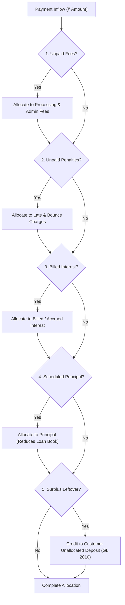

# Payment Allocation Waterfall Engine

## 1. Statutory Waterfall Allocation Priority

The repayment engine implements a strict mathematical priority order for installment distribution:

$$\text{Allocation Priority} = \text{Fees} \longrightarrow \text{Penalties} \longrightarrow \text{Interest} \longrightarrow \text{Principal} \longrightarrow \text{Excess / Surplus}$$

---

## 2. Multi-Installment Amortization Traversal

1. **Chronological Sorting**: Repayment schedules are sorted by `emiNumber ASC`.
2. **Oldest Dues First**: Delinquent and overdue installments are cleared prior to regular/current installments.
3. **Prepayment & Excess Handling**:
   - If principal is repaid ahead of schedule, the loan outstanding principal drops immediately.
   - If total loan outstanding reaches ₹0.00 and no further unpaid schedule items exist, the loan status automatically transitions to `CLOSED`.
   - Any excess funds beyond full loan closure are categorized as `EXCESS` and credited to Liability Account `2010 (Customer Unallocated & Excess Repayment Deposits)`.
4. **Revolving Credit Limit Restoration**:
   - Whenever principal is repaid on an active credit facility or revolving credit line, the facility's `utilizedAmount` is automatically decremented and `availableAmount` is restored up to the sanctioned limit.
