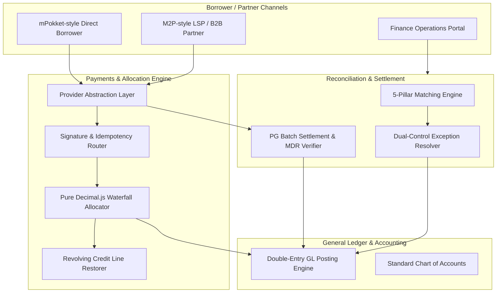

# Phase 10: Payments, Reconciliation & Settlement Infrastructure Engine

## 1. Executive Summary

The **Payments, Reconciliation & Settlement Infrastructure** forms the transactional backbone of the Adyapan Lending OS. It is engineered to support both **M2P-style B2B/Lender Infrastructure** (high-throughput multi-tenant APIs, credit facilities, webhook dispatches) and **mPokket-style Instant Digital Lending** (UPI dynamic QRs, instant loan disbursements, realtime payment allocation, automated refunds, and reconciliations).

---

## 2. Core Architectural Principles

1. **Deterministic Precision**: All monetary operations utilize arbitrary-precision arithmetic (`Decimal.js`) to guarantee exact fractional balance calculations without floating-point errors.
2. **Double-Entry Accounting Invariant**: Every financial mutation enforces balanced journal entries (`Total Debits == Total Credits`) across the Standard Chart of Accounts.
3. **Idempotency & Replay Protection**: Webhooks and payment initiation/confirmation workflows enforce strict cryptographic uniqueness keys to prevent double-debits or duplicate allocations.
4. **Segregation of Duties (SoD)**: Enforces structural role separation between Disbursement Initiators, Reconciliation Resolvers, and Collection Officers.
5. **Provider Abstraction**: Decoupled gateway interfaces (`PaymentProvider`, `PayoutProvider`) enabling pluggable integrations (Razorpay, Cashfree, Core Banking NEFT/IMPS) and zero-friction sandbox testing.

---

## 3. High-Level Architecture Diagram

