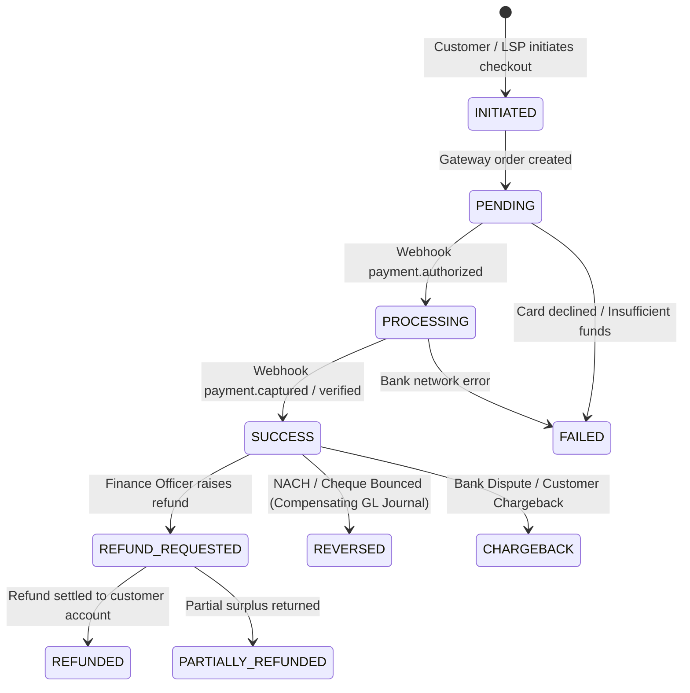
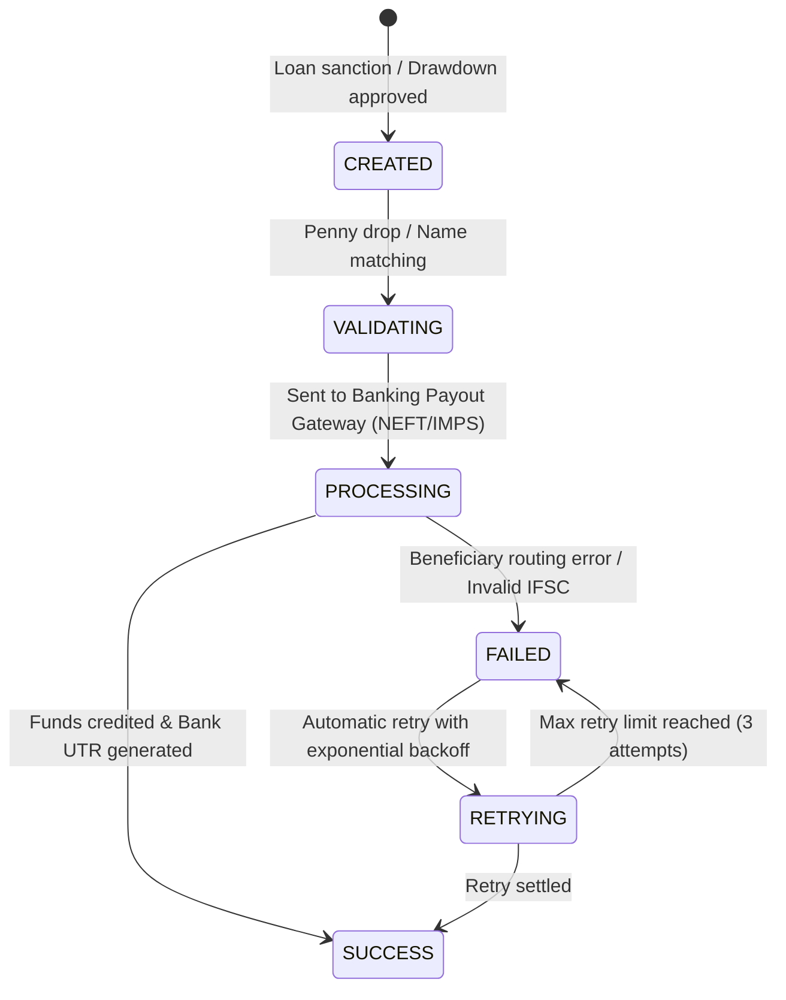

# Payment & Payout Transaction Lifecycles

## 1. Repayment Lifecycle & State Machine

Every repayment transaction adheres to a finite state machine with immutable audit logging and state transitions:

### State Definitions
- **`INITIATED`**: Checkout intent created; unique idempotency token and order generated.
- **`PENDING`**: Waiting for customer OTP / UPI PIN authentication.
- **`PROCESSING`**: Authorized by payment gateway; awaiting confirmation and settlement capture.
- **`SUCCESS`**: Funds captured; pure waterfall allocation executed; loan balances reduced; double-entry repayment journal posted.
- **`FAILED`**: Explicit decline or timeout from bank/gateway.
- **`REFUNDED`**: Funds returned to borrower; unallocated excess or payment reversed via `postRefundJournal`.
- **`REVERSED`**: Payment revoked/bounced; schedule items and loan balances restored; compensating reversal entry posted via `postReversalJournal`.
- **`CHARGEBACK`**: Bank dispute deduction provisioned via `postChargebackJournal`.

---

## 2. Disbursement / Payout Lifecycle

