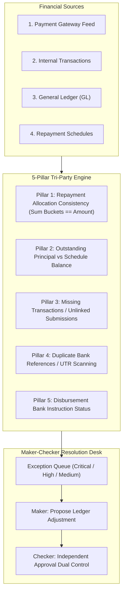

# Multi-Pillar Reconciliation & Financial Exception Handling

## 1. 5-Pillar Matching Engine

The automated reconciliation engine performs exhaustive multi-way matching across:
1. **Gateway / Bank Statement Records** (External Webhook / Bank Settlement feed)
2. **Internal Transaction Logs** (`prisma.transaction` and `PaymentSubmission`)
3. **Double-Entry General Ledger (GL)** (`GeneralLedgerService` & Trial Balance)
4. **Loan Repayment Schedules** (`RepaymentScheduleItem` paid vs outstanding)
5. **Customer Exposure & Facility Balances** (`CreditFacility` utilized vs approved)

---

## 2. Maker-Checker Segregation of Duties

- Any financial adjustment $\ge \text{₹5,000}$, ledger correction, or payment reversal triggers `PENDING_APPROVAL` status.
- **SoD Policy (`SOD_RECONCILIATION_RESOLVER_AUDITOR`)**: The user proposing an adjustment cannot approve their own adjustment. A distinct Finance Officer or Super Admin Checker must validate the audit justification.
