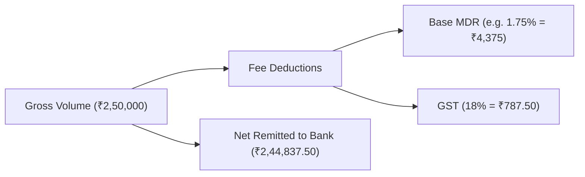

# Gateway Settlement & MDR Fee Variance Engine

## 1. Settlement Calculation Model

For every payment gateway remittance batch (e.g., $T+1$ or $T+2$ settlements), the net amount remitted to the institutional nodal bank account is computed as:

$$\text{Net Settled Amount} = \text{Gross Volume} - \text{MDR Processing Fee} - \text{Statutory GST (18\%)}$$

---

## 2. Fee Variance Auditing

- **Contracted MDR Benchmark**: Every provider profile configures an agreed Merchant Discount Rate (e.g., 1.50% UPI, 1.85% NetBanking, 2.10% Credit Card).
- **Automated Discrepancy Flagging**: If the actual fees deducted by the gateway deviate by more than ₹5.00 from the calculated contractual benchmark, the batch status is automatically set to `DISCREPANCY` and highlighted on the Finance Dashboard.

---

## 3. Automated Double-Entry Settlement GL Entry

When a settlement batch is confirmed:
- **Debit Account `1010` (Disbursement & Settlement Bank Account)**: Net settled funds.
- **Debit Account `5010` (Gateway & Payment Processing Fee Expense)**: Total MDR + GST deducted.
- **Credit Account `2010` (Customer Unallocated & Excess Repayment Deposits / Clearing)**: Gross volume.

$$\text{Total Debits} = \text{Net} + \text{MDR} + \text{GST} = \text{Gross} = \text{Total Credits}$$
