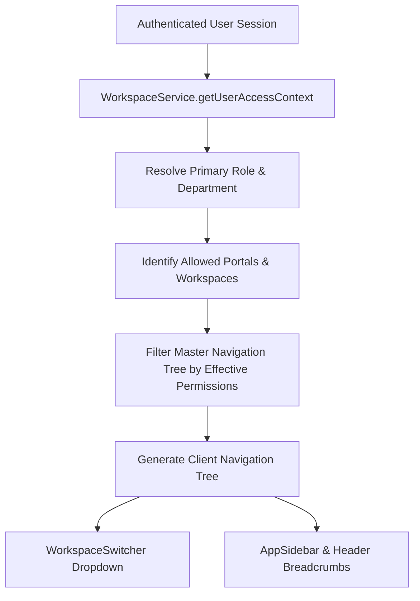

# Workspace, Department, Portal & Navigation Architecture

## 1. Architectural Philosophy

The **Adyapan Lending OS** Phase 16 architecture transitions the platform from disparate dashboards into an enterprise-grade multi-tenant operating system. 

Instead of hardcoded UI navigation (e.g. `if (role === 'admin')`), navigation and access control are model-driven and authoritative:
```
User -> Role -> Department -> Workspace -> Permissions -> Navigation Items
```

Every user session operates within a strictly defined, tenant-isolated access context that is enforced both client-side via route & permission guards and server-side via workspace resolution services.

---

## 2. Core Entities & Concepts

### 2.1 Department vs Role Separation
* **Role**: Defines operational capabilities and authority tier (e.g. `SUPER_ADMIN`, `ADMIN`, `LOAN_OFFICER`, `BRANCH_MANAGER`, `CREDIT_ANALYST`, `UNDERWRITER`, `COLLECTION_OFFICER`, `FINANCE_OFFICER`, `CUSTOMER`, `PARTNER`).
* **Department**: Defines the organizational domain or operational unit the user belongs to:
  * `ADMINISTRATION` — System governance, tenants, security, and audit.
  * `OPERATIONS` — Loan origination, borrower verification, customer servicing, branch desks.
  * `CREDIT` — Risk scoring, underwriting, decision engine policies, credit assessment.
  * `COLLECTIONS` — Delinquency management, DPD tracking, recovery & settlement.
  * `FINANCE` — General ledger, double-entry accounting, disbursements, treasury, reconciliation.
  * `MANAGEMENT` — Executive leadership, portfolio analytics, command center, MIS.
  * `BORROWER` — Consumer digital lending, self-service applications, loan servicing.
  * `PARTNER` — LSP / Co-lending partner portal and lead management.

### 2.2 Portal Architecture
Portals represent the high-level operational spheres of the lending institution:

| Portal Key | Name | Target Persona / Audience |
| :--- | :--- | :--- |
| `PUBLIC` | Public & Marketing Portal | Unauthenticated visitors, marketing pages, eligibility calculator |
| `OPERATIONS` | Lending Operations Portal | Loan Officers, Branch Managers, Field Agents, Servicing Team |
| `CREDIT` | Credit & Underwriting Portal | Credit Analysts, Risk Underwriters, Credit Committee |
| `COLLECTIONS` | Collections & Recovery Portal | Collection Agents, Recovery Officers, Legal Team |
| `FINANCE` | Finance & Treasury Portal | Finance Officers, Accountants, Treasury Managers |
| `MANAGEMENT` | Executive Command Portal | CXOs, MDs, Risk Heads, Branch Heads, Board Members |
| `ADMIN` | System Administration Portal | Super Admins, Tenant Admins, Compliance Officers |
| `BORROWER` | Consumer Digital Lending Portal | Borrowers, Retail Customers, MSME Applicants |
| `PARTNER` | Partner & Co-Lending Portal | LSP Partners, Sourcing Agents, DSA Network |

### 2.3 Workspace Registry
Each Portal houses specialized Workspaces tailored for specific day-to-day operational functions:
* **Operations Portal**:
  * `OPERATIONS_DESK` (Lending Operations Desk)
  * `BRANCH_DESK` (Branch Management Desk)
  * `CUSTOMER_SERVICE` (Customer Servicing Desk)
* **Credit Portal**:
  * `CREDIT_ASSESSMENT` (Credit Assessment Desk)
  * `CREDIT_UNDERWRITING` (Credit Underwriting & Sanction)
  * `RISK_FRAUD_DESK` (Risk & Fraud Cockpit)
* **Collections Portal**:
  * `DELINQUENCY_DPD` (Delinquency & DPD Management)
  * `LEGAL_RECOVERY` (Legal & Hard Recovery Desk)
* **Finance Portal**:
  * `FINANCE_GL` (General Ledger & Double-Entry Accounting)
  * `FINANCE_TREASURY` (Treasury & Disbursements)
  * `FINANCE_RECON` (Payment & Bank Reconciliation)
* **Management Portal**:
  * `COMMAND_CENTER` (Executive Command Center)
  * `PORTFOLIO_ANALYTICS` (Portfolio & MIS Intelligence)
* **Admin Portal**:
  * `SYSTEM_ADMIN` (System Administration & Tenancy)
  * `AUDIT_COMPLIANCE` (Audit Ledger & Statutory Compliance)
* **Borrower Portal**:
  * `BORROWER_HOME` (Borrower Self-Service Cockpit)
  * `BORROWER_LOANS` (Active Loans & Statements)
  * `BORROWER_SUPPORT` (Support & Inquiries)
* **Partner Portal**:
  * `PARTNER_PORTAL` (Co-Lending & Sourcing Desk)

---

## 3. Dynamic Navigation Resolution Pipeline



1. **Backend Verification (`/api/v1/workspaces/context`)**: Returns the authoritative `UserAccessContext`, list of accessible `Portals`, list of accessible `Workspaces`, active `WorkspaceKey`, effective permissions, and filtered navigation trees.
2. **Server-Side Switch Validation (`/api/v1/workspaces/switch`)**: When a user switches workspaces, the server strictly validates that the requested workspace is within their permitted list, returning a `403 Forbidden` if unauthorized and emitting an immutable audit event upon success.
3. **Frontend Shell (`<AppShell />`)**:
   - Manages active workspace and dynamic sidebar navigation.
   - Automatically adapts layout: routes under `/borrower/*` render consumer layout while staff routes render enterprise sidebar with badge telemetry and search.
   - Seamless breadcrumb path and page title generation.

---

## 4. Route Guards & Access Enforcement

* `<PermissionGuard permission="..." />`: Checks whether the user holds the required granular permission (or Super Admin wildcard `*`), rendering a dedicated `403 Access Restricted` state if unauthorized.
* `<WorkspaceGuard workspace="..." />`: Ensures that the active user has access to the target workspace before rendering child route content.
* `<PortalGuard portal="..." />`: Validates portal-level authorization.
* Dedicated Route: `/access-restricted` provides a friendly, institutional 403 page with quick navigation back to authorized workspaces.

---

## 5. Backward Compatibility & Non-Breaking Guarantee

All existing legacy routes (e.g., `/dashboard`, `/applications`, `/loans`, `/credit`, `/collections`, `/accounting`, `/analytics`, `/admin`, `/borrower`) remain fully functional. No core financial, Bre, DPD, or accounting engines were altered.
