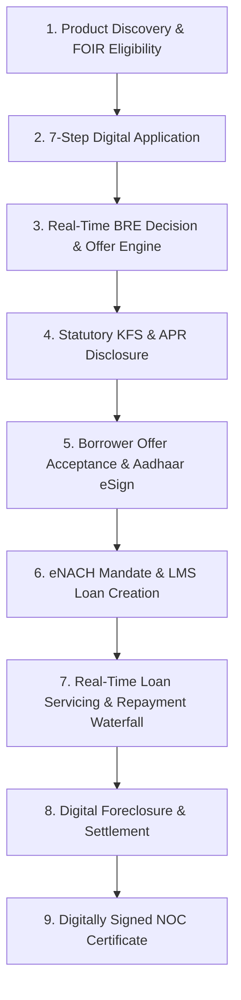

# Consumer Digital Lending & Borrower Journey

## Overview

The Consumer Digital Lending module in Adyapan Lending OS provides a modern direct-to-consumer digital borrowing experience while integrating seamlessly with the underlying multi-tenant enterprise core (BRE Studio, Approval Matrix, Risk & Fraud Engine, Payments & Payouts, Accounting & GL, Collections, and Partner LSP platform).

---

## The 9-Stage Borrower Lifecycle

### Stage 1: Product Discovery & FOIR-based Eligibility
- **Objective:** Allow consumers to discover available credit products and calculate maximum borrowing eligibility with zero impact on credit bureau scores.
- **Algorithm:** Uses Fixed Obligation to Income Ratio (FOIR $\le 50\%$) to compute the maximum sustainable monthly EMI:
  $$\text{Max EMI} = (\text{Monthly Income} \times 0.50) - \text{Existing Obligations}$$
  $$\text{Max Principal} = \frac{\text{Max EMI} \times (1 - (1 + r)^{-n})}{r}$$
- **Consumer Privacy:** Safe messaging returned without internal risk scores or underwriting cutoffs.

### Stage 2: Progressive 7-Step Digital Application
1. **Loan Requirement:** Amount & tenure sliders, loan purpose selector.
2. **Personal Information:** Name, DOB, gender, current address, residential status.
3. **Employment & Income:** Salaried / Self-Employed, employer details, monthly take-home income.
4. **Identity & Digital KYC:** PAN validation and DigiLocker / Aadhaar verification consent.
5. **Bank Account Details:** Account holder name, account number, IFSC code, account type (Savings/Current) for disbursement and mandate debiting.
6. **Statutory Consents & Declarations:** Explicit checkboxes for Credit Bureau inquiry, Data processing, and Master Loan Terms.
7. **Review & Instant Submission:** One-click submission into the automated underwriting funnel.

### Stage 3: Real-Time Underwriting & Binding Offer Generation
- Seamless integration with the BRE (Business Rule Engine) and Risk Assessment service.
- Produces a binding consumer loan offer (`off-{id}`) with clear repayment terms and 7-day validity.

### Stage 4: RBI Key Fact Statement (KFS) & APR Disclosure
- Generates a standardised Key Fact Statement formatted in strict adherence to RBI Digital Lending Directives.
- Calculates true **Annual Percentage Rate (APR)** factoring upfront processing fees and applicable GST:
  $$\text{APR} = \text{Nominal Annual Rate} + \frac{\text{Total Upfront Fees}}{\text{Sanctioned Principal} \times \text{Tenure (Years)}} \times 100$$
- Displays mandatory **3-day Cooling-Off / Look-Up Period** allowing borrowers to exit the facility without penalty by repaying principal and proportionate interest.
- Highlights lender identity, Grievance Redressal Officer (GRO) contact information, and RBI Ombudsman escalation matrix.

### Stage 5: Offer Acceptance & Aadhaar eSign Verification
- Simulates certified UIDAI Aadhaar OTP eSign verification.
- Generates a tamper-proof SHA-256 audit hash binding the borrower identity, loan agreement, and acceptance timestamp.

### Stage 6: eNACH Mandate Registration & LMS Loan Disbursement
- Sets up an automated repayment mandate (eNACH / UPI AutoPay) linked to the borrower's verified bank account.
- Disburses loan facility into the LMS core with status `ACTIVE`, initializing the amortized repayment schedule.

### Stage 7: Real-Time Loan Servicing & Repayment Waterfall
- Real-time loan servicing dashboard displaying:
  - Sanctioned principal vs total outstanding.
  - Next EMI due date, amount, and payment status.
  - Detailed amortization schedule with installment breakdown (Principal, Interest, Total Due).
- Digital payment execution supporting UPI (`upi://`), NetBanking, and Debit Cards.
- Transparent waterfall allocation:
  $$\text{Payment} \rightarrow \text{Overdue Penalties} \rightarrow \text{Accrued Interest} \rightarrow \text{Principal Reduction}$$

### Stage 8: Digital Foreclosure & Settlement
- Enables one-click full settlement with automated future unaccrued interest waiver.
- Immediate loan account transition to `CLOSED` status.

### Stage 9: Statutory No-Objection Certificate (NOC)
- Generates verifiable digital No-Objection Certificate with unique certificate numbering (`NOC-YYYY-{accountNo}`) and SHA-256 digital signature hash.
- Provides immediate PDF download capability for the borrower.
