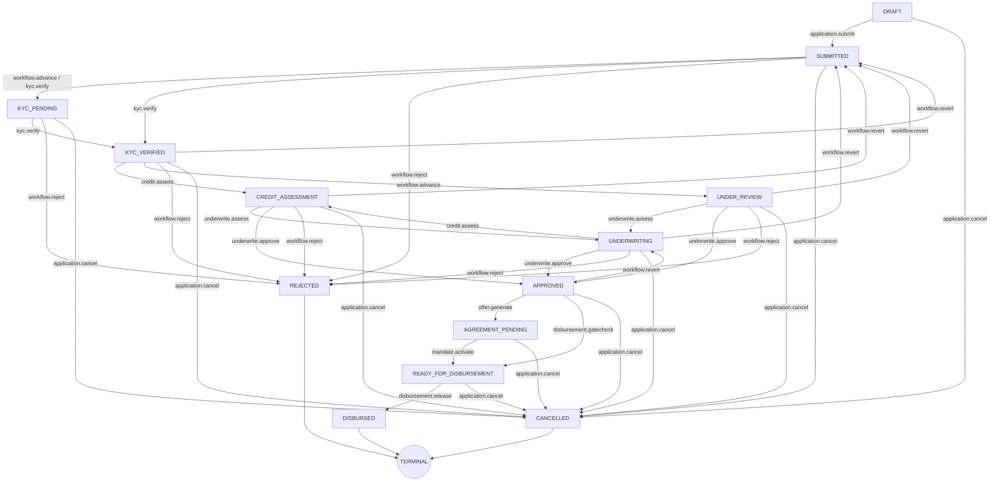

# ADYAPAN LENDING OS — AUTHORITATIVE WORKFLOW ARCHITECTURE (P4)

## 1. Executive Summary & Authoritative Paradigm

In **Adyapan Lending OS**, the backend workflow state machine (`WorkflowTransitionService`) is the **single authoritative business process gatekeeper** for all loan applications and lifecycle transitions. 

No frontend UI component, portal, direct database query, or unverified API endpoint can advance an application's state, bypass stage prerequisites, or circumvent dual-control governance.

### Core Architectural Axioms
1. **Zero-Trust State Transitions**: The frontend UI is purely a projection of backend eligibility. All stage transitions must be requested via `POST /api/v1/applications/:id/transition` or `POST /api/v1/applications/:id/submit`.
2. **Explicit Transition Graph Invariance**: Any transition outside the strict state graph definition is rejected with `400 INVALID_TRANSITION_STATE`.
3. **Hard Prerequisite Gatekeeping**: An application cannot enter a state without meeting all upstream domain checks (Aadhaar/PAN, cashflow parsing, BRE rules, 6-pillar risk scoring, zero fraud holds, sanction limit matching, borrower offer acceptance, Aadhaar eSign, e-NACH mandate, and 10-point Pre-Disbursement verification).
4. **Strict RBAC & Dual-Control (Maker-Checker / SoD)**: P2 `domain.action` RBAC and Separation of Duties rules prevent operators from self-approving loans they created, dual-signoff is enforced for financial release, and auditors are hard-restricted to read-only views.
5. **Multi-Tenant & Scope Isolation**: Strict `ScopeResolver` validation guarantees zero-trust isolation across tenant, branch, customer, and partner boundaries, completely eliminating IDOR vulnerabilities.
6. **Concurrency & Idempotent Execution**: State transitions use atomic versioning, optimistic locking, and append-only audit event logging in `application_events`.

---

## 2. Authoritative State Graph Definition



---

## 3. Stage-Gate Hard Prerequisite Matrix

| Target State | Required Permission | Mandatory Server-Side Prerequisites | Invariant Error Contract |
| :--- | :--- | :--- | :--- |
| **`SUBMITTED`** | `application.submit` or `application.create` | Applicant identity populated; non-empty loan requested amount and product type; valid loan purpose. | `409 WORKFLOW_PREREQUISITE_NOT_MET: Applicant details missing` |
| **`KYC_VERIFIED`** | `kyc.verify` or `kyc.review` | Complete Aadhaar XML/OTP verification + Validated PAN tax record match. | `409 WORKFLOW_PREREQUISITE_NOT_MET: KYC Verification Incomplete` |
| **`CREDIT_ASSESSMENT`** | `credit.assess` or `workflow.advance` | Verified KYC status + Parsed bank statements / verified income cashflow telemetry. | `409 WORKFLOW_PREREQUISITE_NOT_MET: Bank statement and cashflow data required` |
| **`UNDERWRITING`** | `underwrite.assess` or `workflow.advance` | Credit score generated + 6-Pillar Risk calculation completed + Zero unreviewed fraud flags (`fraudRiskLevel !== 'HIGH'` / zero active `FRAUD_HOLD`). | `409 WORKFLOW_PREREQUISITE_NOT_MET: Risk assessment incomplete or Active Fraud Hold present` |
| **`APPROVED`** | `underwrite.approve` | Underwriting credit sanction within approver authority limit + BRE approval rules satisfied + Strict Maker-Checker separation (approver $\neq$ applicant/creator). | `409 WORKFLOW_PREREQUISITE_NOT_MET: Underwriter sanction or BRE criteria unmet / Maker-Checker violation` |
| **`READY_FOR_DISBURSEMENT`** | `offer.accept` or `disbursement.gatecheck` | Formal Key Fact Statement (KFS) generated + Borrower Offer accepted + Aadhaar eSign executed + e-NACH auto-debit mandate active and registered with NPCI. | `409 WORKFLOW_PREREQUISITE_NOT_MET: eSign contract, KFS, or e-NACH mandate missing` |
| **`DISBURSED`** | `disbursement.release` | 10-Point Pre-Disbursement Gatekeeper automated signoff passed + Dual-Control Maker-Checker finance release (disburser $\neq$ underwriter / disburser $\neq$ creator). | `409 WORKFLOW_PREREQUISITE_NOT_MET: Pre-Disbursement Gatekeeper check failed or Dual Control violation` |

---

## 4. Separation of Duties (SoD) & Role Governance

The workflow engine enforces strict dual-control and governance policies at every critical stage:

1. **Maker-Checker on Approval (`APPROVED`)**:
   - The user approving the application (`ctx.userId`) must NOT be the user who created or submitted the application (`application.createdById` or `application.metadata.submittedBy`).
2. **Dual Control on Disbursement (`DISBURSED`)**:
   - The user releasing loan funds must NOT be the underwriter who sanctioned/approved the application (`application.approvedById` or `application.metadata.approvedBy`), nor the creator.
3. **Auditor & Read-Only Governance**:
   - `AUDITOR` and `OPERATIONS_VIEWER` roles cannot invoke any state transition (`POST /transition` or `POST /submit`). All transition requests by audit roles return `403 FORBIDDEN: Insufficient permissions for state transition`.
4. **Admin Direct Bypass Prevention**:
   - `SUPER_ADMIN` and `ADMIN` cannot bypass stage prerequisites or force illegal state transitions without satisfying the mandatory domain verifications.

---

## 5. Scope Isolation & Multi-Tenant IDOR Protection

All state transitions and eligibility queries pass through the P2 `ScopeResolver`:

```typescript
const scope = ScopeResolver.resolve(ctx);
if (scope.type === 'CUSTOMER') {
  if (app.customerId !== scope.customerId) {
    throw new ForbiddenException('IDOR: Cannot access application outside customer scope');
  }
} else if (scope.type === 'BRANCH') {
  if (app.branchId && !scope.branchIds.includes(app.branchId)) {
    throw new ForbiddenException('IDOR: Application outside accessible branches');
  }
} else if (scope.type === 'PARTNER') {
  if (app.partnerId !== scope.partnerId) {
    throw new ForbiddenException('IDOR: Application outside partner scope');
  }
}
```

---

## 6. Real-Time State Eligibility API & Frontend Gate Synchronizer

The backend exposes an authoritative eligibility endpoint:
```http
GET /api/v1/applications/:id/workflow-state
```

Response payload:
```json
{
  "success": true,
  "data": {
    "applicationId": "app-001",
    "currentState": "APPROVED",
    "allowedNextStates": ["AGREEMENT_PENDING", "READY_FOR_DISBURSEMENT", "UNDERWRITING", "CANCELLED"],
    "missingPrerequisites": [
      {
        "targetState": "READY_FOR_DISBURSEMENT",
        "missing": ["eSign contract missing", "Active e-NACH mandate required"]
      }
    ],
    "canTransition": {
      "AGREEMENT_PENDING": true,
      "READY_FOR_DISBURSEMENT": false,
      "UNDERWRITING": true,
      "CANCELLED": true
    },
    "sodViolations": []
  }
}
```

The frontend components (`WorkflowStageGate.tsx` and `workflow-gates.ts`) consume this API to:
1. Lock advance buttons when prerequisites are unsatisfied or user lacks required permission.
2. Display human-readable prerequisite checklists detailing exact missing items.
3. Handle `409 WORKFLOW_PREREQUISITE_NOT_MET` cleanly with structured alert modals instead of silent failures.
