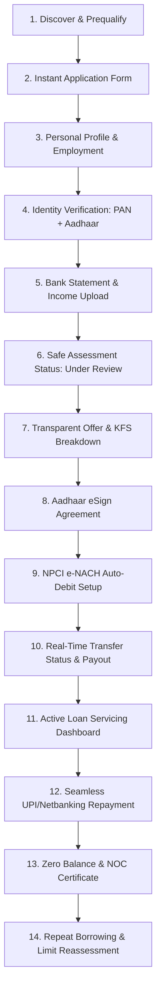

# ADYAPAN LENDING OS — BORROWER EXPERIENCE ARCHITECTURE (P6)

## 1. Executive Summary & Customer-Safe Paradigm

In **Adyapan Lending OS**, the borrower journey is delivered as an instant, mobile-first, transparent direct-lending experience while strictly adhering to backend governance:
- **P2 Role-Based Access Control & Canonical Permissions** (`domain.action`)
- **P2 ScopeResolver** (Zero-Trust Customer, Branch & Tenant IDOR Isolation)
- **P4 WorkflowTransitionService** (Authoritative State Gating)
- **P5 FinancialControlService** (Dual-Control Maker-Checker & Double-Entry GL Integrity)

No client component can advance application state, modify financial figures, bypass stage prerequisites, or access cross-customer records.

---

## 2. End-to-End Borrower Lifecycle Journey



---

## 3. Customer-Safe State Mapping & Language Normalization

Internal technical terminology is strictly forbidden in customer-facing interfaces. The authoritative `BorrowerJourneyService` maps internal statuses to customer-friendly terminology:

| Internal Workflow Status | Borrower Portal Label | Visual Stepper Stage | Next Step Guidance |
| :--- | :--- | :--- | :--- |
| **`DRAFT`** | Application Incomplete | `PROFILE_PENDING` (15%) | Complete personal, employment, and income details. |
| **`SUBMITTED` / `KYC_PENDING`** | Identity Verification in Progress | `KYC_PENDING` (35%) | Verify Aadhaar and PAN identity. |
| **`KYC_VERIFIED` / `CREDIT_ASSESSMENT` / `UNDER_REVIEW` / `UNDERWRITING`** | Application Under Review | `UNDER_REVIEW` (60%) | Loan assessment in progress. We will notify you once your offer is ready. |
| **`APPROVED`** | Loan Approved — Offer Ready | `OFFER_READY` (75%) | Review and accept your loan offer & Key Fact Statement (KFS). |
| **`AGREEMENT_PENDING`** | Agreement Signing Pending | `AGREEMENT_PENDING` (85%) | Sign your loan contract using Aadhaar OTP eSign. |
| **`READY_FOR_DISBURSEMENT`** | Disbursement in Progress | `DISBURSEMENT_PENDING` (95%) | Transferring funds to your verified bank account. |
| **`DISBURSED`** | Active Loan Disbursed | `ACTIVE_LOAN` (100%) | Manage monthly EMI repayments and loan servicing. |
| **`REJECTED`** | Application Closed | `DISCOVER` | Explore new eligibility when criteria are met. |

### Forbidden vs Customer-Safe Terminology Matrix
| Forbidden Internal Term | Customer-Safe Normalized Term |
| :--- | :--- |
| `BRE`, `Decision Rules`, `Rule Engine` | `Loan assessment criteria` |
| `FOIR`, `DTI`, `Banking Multiplier` | `Monthly repayment capacity` |
| `Risk Grade A/B/C`, `Bureau Score` | `Eligibility criteria check` |
| `Fraud Score`, `Syndicate Cluster`, `Anomaly Flag` | `Security & verification check` |
| `Underwriter Remarks`, `Committee Approval` | `Application review` |
| `Maker-Checker`, `Dual Control`, `SoD` | `Verification & processing` |
| `General Ledger`, `GL Suspense`, `Waterfall` | `Loan account statement` |

---

## 4. Application Resume & Deep-Link Resolution

The borrower can safely close their browser, lose internet connection, or switch devices. The server-authoritative state automatically determines the exact resume route:

```typescript
switch (status) {
  case 'DRAFT': return `/customer/applications/${appId}`;
  case 'KYC_PENDING': return `/customer/documents`;
  case 'APPROVED': return `/customer/offers`;
  case 'AGREEMENT_PENDING': return `/customer/documents`;
  case 'DISBURSED': return `/customer/loans`;
  default: return `/customer/applications/${appId}`;
}
```

---

## 5. Transparent Pricing & Key Fact Statement (KFS)

Before offer acceptance, borrowers are presented with a complete, itemized KFS breakdown derived exclusively from backend engines:
- **Sanction Amount**: Approved principal.
- **Tenure**: Number of monthly instalments.
- **Interest Rate & Method**: Annual percentage with reducing balance calculation.
- **Processing Fees & Taxes**: Itemized fee + 18% GST.
- **Net Disbursement Amount**: $\text{Sanction Amount} - \text{Processing Fees} - \text{GST}$.
- **Annual Percentage Rate (APR)**: Total cost of credit expressed as an annualized rate.
- **Schedule**: Itemized principal vs interest waterfall for every monthly EMI.

---

## 6. Zero-Trust Customer IDOR Defense

All customer-facing endpoints are protected against cross-customer tampering:
```typescript
ScopeResolver.validateCustomerAccess(authenticatedUser, requestedCustomerId);
```
Attempts by Borrower A to inspect or mutate Borrower B's applications, loans, document uploads, repayment receipts, or support tickets are halted with `403 Forbidden: Customer access violation`.
